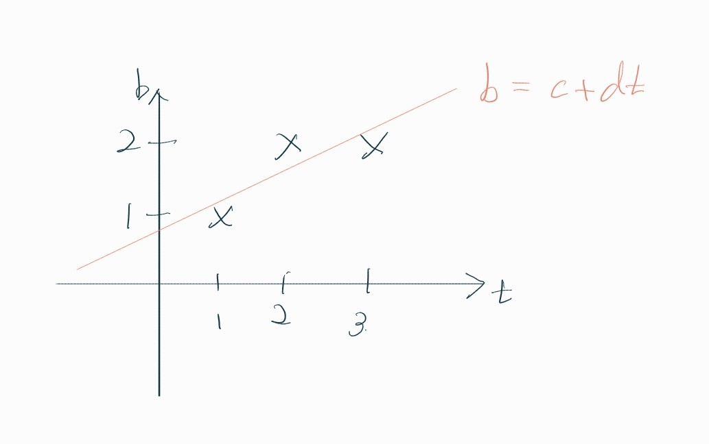

# 📚 Lecture 15: Projections onto subspaces

**○ Projections**
<p align="center">
    
</p>

```math
\begin{align}
\text{For}\quad \vec{\underset{(n \times 1)}a}, \vec{\underset{(n \times 1)}b} \quad
\begin{cases}
\vec{a}^{T}(\vec{b} - k\vec{a}) = 0 \\
k\vec{a}^{T}\vec{a} = \vec{a}^{T}\vec{b} \\
k = \frac{\vec{a}^{T}\vec{b}}{\vec{a}^{T}\vec{a}}
\end{cases} \\\\

\text{proj.}\quad \vec{p} = \vec{a}k = \vec{a}\frac{\vec{a}^{T}\vec{b}}{\vec{a}^{T}\vec{a}}
= (\frac{\vec{a}\vec{a}^{T}}{\vec{a}^{T}\vec{a}})\vec{b} = \underset{(n \times n)}P\vec{b} \\\\
P = \frac{\vec{a}\vec{a}^{T}}{\vec{a}^{T}\vec{a}}
\end{align}
```

$C(P)$ : Line through $\vec{a}$<br>
$rank(P) = 1$<br>

- Why project?<br>
Because $A\vec{x} = \vec{b}$ may have no solution.<br>
To choose the closest vector in the column space,<br>
solve $A\vec{\hat{x}} = \vec{p}$ instead of $\vec{b}$.<br>
($\vec{p}$ : proj. of $\vec{b}$ onto the column space.)<br>

plane of $(\vec{a_{1}}, \vec{a_{2}}) = C(A)$ (→ Column space of $A$)<br>
$(A = [\vec{a_{1}} \vec{a_{2}}])$<br>
$\vec{p} = \hat{x_{1}}\vec{a_{1}} + \hat{x_{2}}\vec{a_{2}} = A\vec{\hat{x}}$<br><br>
Find $\vec{\hat{x}}$<br>
key : $(\vec{e} = \vec{b}-\vec{p} = \vec{b}-A\vec{\hat{x}})$ is perpendicular to the plane.

```math
\begin{align}
\vec{e} (= \vec{b}-A\vec{x}) \in N(A^{T}) \\
\vec{e} \perp C(A)
\end{align}
```

```math
\begin{align}
\begin{cases}
\vec{a_{1}}^{T}(\vec{b}-A\vec{\hat{x}}) = 0 \\
\vec{a_{2}}^{T}(\vec{b}-A\vec{\hat{x}}) = 0
\end{cases} \\\\
\text{→}\quad \begin{bmatrix} \vec{a_{1}}^{T} \\ \vec{a_{2}}^{T} \end{bmatrix} (\vec{b}-A\vec{\hat{x}}) = A^{T} (\vec{b}-A\vec{\hat{x}}) = \begin{bmatrix} 0 \\ 0 \end{bmatrix} \\\\
\begin{cases}
A^{T}A\vec{\hat{x}} = A^{T}\vec{b} \\
\vec{\hat{x}} = (A^{T}A)^{-1}A^{T}\vec{b} \\
\vec{\hat{p}} = A\vec{\hat{x}} = A(A^{T}A)^{-1}A^{T}\vec{b} = P\vec{b} \end{cases} \\
\text{→}\quad\therefore\quad P = A(A^{T}A)^{-1}A^{T} \\
\end{align}
```

- $P^{T} = P$ : Symmetric<br>

```math
\begin{align}
P^{T} {} &= (A(A^{T}A)^{-1}A^{T})^{T} \\
&= (A^{T})^{T}((A^{T}A)^{-1})^{T}A^{T} \\
&= A(A^{T}A)^{-1}A^{T} \quad<\because\quad (M^{-1})^{T} = (M^{T})^{-1}> \\
&= P
\end{align}
```

- $P^{2} = P$ : Project twice, get the same answer as did in the first projection.<br>

```math
\begin{align}
P^{2} = PP {} &= (A(A^{T}A)^{-1}A^{T})(A(A^{T}A)^{-1}A^{T}) \\
&= A(A^{T}A)^{-1}(A^{T}A)(A^{T}A)^{-1}A^{T} \\
&= A(A^{T}A)^{-1}A^{T} \\
&= P
\end{align}
```

<br><br><br>

# 📚 Lecture 16: Projection matrices and least squares

- If $\vec{b}$ $\in$ column space, then $P\vec{b} = \vec{b}$
```math
\begin{align}
P\vec{b} {} &= A(A^{T}A)^{-1}A^{T}\vec{b} \\
&= A(A^{T}A)^{-1}A^{T}A\vec{x} \quad (\vec{b} = A\vec{x}, \quad \because \ \vec{b} \in \text{column space}) \\
&= A\vec{x} \\
&= \vec{b}
\end{align}
```
<br>

- If $\vec{b}$ $\perp$ column space, then $P\vec{b} = \vec{0}$
```math
\begin{align}
P\vec{b} {} &= A(A^{T}A)^{-1}A^{T}\vec{b} \\
&= A(A^{T}A)^{-1}\vec{0} \quad (A^{T}\vec{b} = \vec{0}, \quad \because \ \vec{b} \perp \text{column space}) \\
&= \vec{0}
\end{align}
```
<br>

- $(I-P)$ is proj. onto $N(A^{T})$.

```math
\begin{align}
\vec{e} {} &= \vec{b} - \vec{p} \\
&= I\vec{b} - P\vec{b} \\
&= (I-P)\vec{b}
\end{align}
```

```math
\begin{align}
\vec{b} {} &= \vec{p} + \vec{e} \\
&= P\vec{b} + (I-P)\vec{b}
\end{align}
```

<br>

**○ Least Squares**

- Fitting by a line<br>
For 3 points : $[(1,1), (2,2), (3,2)]$

<!--  -->
<p align="center">
    
</p>

```math
\begin{align}
b = c + dt \\\\
\begin{cases}
c + d = 1 \\
c + 2d = 2 \\
c + 3d = 2
\end{cases} \\\\
A\vec{x} = \vec{b} \quad\text{→}\quad \begin{bmatrix} 1 & 1 \\ 1 & 2 \\ 1 & 3 \end{bmatrix}\begin{bmatrix} c \\ d \end{bmatrix} = \begin{bmatrix} 1 \\ 2 \\ 2 \end{bmatrix}
\end{align}
```

There is no solution for this system,<br>
but we can find the best solution by multiplying $A^{T}$.

```math
(A\vec{x} = \vec{b}) \quad\text{→}\quad (A^{T}A\vec{\hat{x}} = A^{T}\vec{b})
```
<br>

- 2 ways to find $\vec{\hat{x}}$

```math
\vec{\hat{x}} = \begin{bmatrix} \hat{c} \\ \hat{d} \end{bmatrix}
```
<br>

1) Solve $A^{T}A\vec{\hat{x}} = A^{T}\vec{b}$

```math
\begin{align}
\begin{cases}
A^{T}A = \begin{bmatrix} 1 & 1 & 1 \\ 1 & 2 & 3 \end{bmatrix}\begin{bmatrix} 1 & 1 \\ 1 & 2 \\ 1 & 3 \end{bmatrix} = \begin{bmatrix} 3 & 6 \\ 6 &  14 \end{bmatrix} \\
A^{T}\vec{b} = \begin{bmatrix} 1 & 1 & 1 \\ 1 & 2 & 3 \end{bmatrix}\begin{bmatrix} 1 \\ 2 \\ 2 \end{bmatrix} = \begin{bmatrix} 5 \\ 11 \end{bmatrix} \quad
\end{cases} \\\\

A^{T}A\vec{\hat{x}} = A^{T}\vec{b} \quad \text{→} \quad
\begin{bmatrix} 3 & 6 \\ 6 & 14 \end{bmatrix}\begin{bmatrix} \hat{c} \\ \hat{d} \end{bmatrix} = \begin{bmatrix} 5 \\ 11 \end{bmatrix} \\

\begin{cases}
3\hat{c} + 6\hat{d} = 5 \\
6\hat{c} + 14\hat{d} = 11
\end{cases} \quad \text{→} \quad
\begin{cases}
\hat{c} = \frac{2}{3} \\
\hat{d} = \frac{1}{2} \\
\end{cases}
\end{align}
```

2) Minimize $\lVert A\vec{\hat{x}} - \vec{b} \rVert^{2} {} = \lVert \vec{e} \rVert^{2}$

```math
\begin{align}
\lVert A\vec{\hat{x}} - \vec{b} \rVert^{2} {} &= \lVert \vec{e} \rVert^{2} \\
&= e_{1}^{2} + e_{2}^{2} + e_{3}^{2} \\
&= (\hat{c}+\hat{d}-1)^{2} + (\hat{c}+2\hat{d}-2)^{2} + (\hat{c}+3\hat{d}-2)^{2} \\
&= 3\hat{c}^{2} + 14\hat{d}^{2}+9+12\hat{c}\hat{d}-10\hat{c}-22\hat{d} \\
&= f(\hat{c},\hat{d})
\end{align}
```

```math
\begin{align}
\text{Minimize} \quad f(\hat{c},\hat{d}) \quad \begin{cases}
\frac{\partial f}{\partial \hat{c}} = 6\hat{c} + 12\hat{d} - 10 = 0 \\
\frac{\partial f}{\partial \hat{d}} = 12\hat{c} + 28\hat{d} - 22 = 0
\end{cases} \quad \text{→} \quad
\begin{cases}
\hat{c} = \frac{2}{3} \\
\hat{d} = \frac{1}{2} \\
\end{cases}
\end{align}
```
<br>

- Find $\vec{p}$ and $\vec{e}$.

<p align="center">
    
</p>

```math
\begin{align}
\vec{p} = \hat{c} + \hat{d}\vec{t} {} &= \frac{2}{3} + \frac{1}{2}\vec{t} \\
&= \begin{bmatrix} \frac{2}{3} \\ \frac{2}{3} \\ \frac{2}{3} \end{bmatrix} + \frac{1}{2}\begin{bmatrix} 1 \\ 2 \\ 3 \end{bmatrix}
= \begin{bmatrix} \frac{7}{6} \\ \frac{5}{3} \\ \frac{13}{6} \end{bmatrix}
\end{align}
```

```math
\vec{e} = \vec{b} - \vec{p} = \begin{bmatrix} 1 \\ 2 \\ 2 \end{bmatrix} - \begin{bmatrix} \frac{7}{6} \\ \frac{5}{3} \\ \frac{13}{6} \end{bmatrix} = \begin{bmatrix} -\frac{1}{6} \\ \frac{1}{3} \\ -\frac{1}{6} \end{bmatrix}
```
<br>

- $\vec{e}$ is<br>
: orthogonal to $C(A)$. (column space of A)<br>
: perpendicular to $\vec{p}$. $(\because \: \vec{p} \in C(A))$

<p align="center">
    
</p>

```math
\begin{align}
\vec{e} \cdot \vec{p} = 0 \quad (\because \: \vec{e} \perp \vec{p}) \\\\
\vec{e}^{T}A = \begin{bmatrix} 1 & 1 \\ 1 & 2 \\ 1 & 3 \end{bmatrix} = \begin{bmatrix} 0 & 0 \end{bmatrix} \quad (\because \: \vec{e} \perp C(A) \quad\text{and}\quad \vec{e} \in N(A^{T}))
\end{align}
```
<br>

- If $A$ has independent columns, then $A^{T}A$ is invertible.<br>
Suppose $A^{T}A\vec{x} = 0$, then $\vec{x}$ must be $\vec{0}$ for $A^{T}A$ to be invertible.
```math
\begin{align}
A^{T}A\vec{x} = \vec{0} \quad\text{→}\quad
\begin{cases}
\vec{x}^{T}A^{T}A\vec{x} = 0 \\
(A\vec{x})^{T}(A\vec{x}) = \lVert A\vec{x} \rVert^{2} = 0 \\
A\vec{x} = \vec{0}
\end{cases} \\
\text{→}\quad \vec{x} = \vec{0} \quad (\because \: A \: \text{has independent columns.}) \\
\text{→}\quad \therefore \: A^{T}A \: \text{is invertible.}
\end{align}
```
<br>

- Columns definitely independent if they are perpendicular unit vectors. (= Orthonormal)
```math
\text{ex)} \quad \begin{bmatrix} 1 \\ 0 \\ 0 \end{bmatrix}, \begin{bmatrix} 0 \\ 1 \\ 0 \end{bmatrix}, \begin{bmatrix} 0 \\ 0 \\ 1 \end{bmatrix}
```
