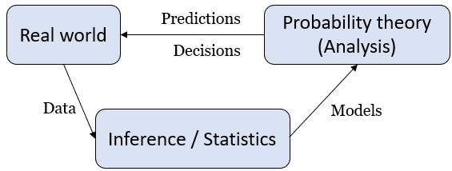

## ¶ The role of probability thoery ¶
<a href="https://chatgpt.com/share/69940feb-fc58-8003-84ab-0f781786b9f3">(❓Chatgpt)</a>

Statistics answers:
- <b>"Given data, what model should we believe?"</b>

Probability answers:
- <b>"If the model is true, what should happen?"</b>

<p align="center">
    
</p><br>

💡Example : <b>Credit default Risk</b><br>
A bank deciding whether to give someone a loan.

In <b>Real world</b>, people borrow money and
- some repay / some default

<b>Data</b>
The bank collects data from past customers.
- Income / Age / Credit score / Employment status / Loan amount
- Whether they defaulted

<b>Inference / Statictics</b><br>
Now statisticians build a model.<br>
e.g. they fit a logistic regression.
```math
P(\text{default}|x) = \frac{1}{1+e^{-(\beta_{0}+\beta^{T}x)}}
```
- Estimate parameters $\beta$ using historical customer data $x$.

<b>Models (Probability Theory)</b><br>
The probability theory lets us :
- compute expected loss risk-adjusted return
- calculate portfolio variance
- price the loan properly and so on.

```math
\text{e.g.}\quad \text{Expected Loss} = P(\text{default}) \times \text{Loss given default}
```

<b>Predictions / Decisions</b><br>
Bank policy :
- If $P$(default) $> 0.4$, then reject loan.
- If moderate risk, then increase interest rate.
- If low risk, then approve at normal rate.

This model <b>chages the real world</b>.<br>
Then new loans <b>generate new data</b>.

─────💡
