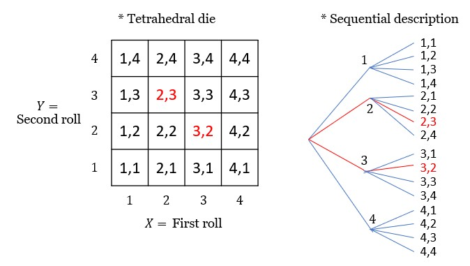
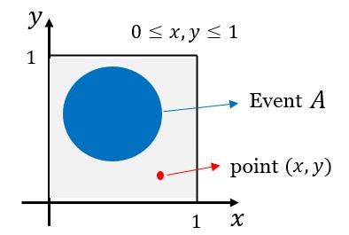
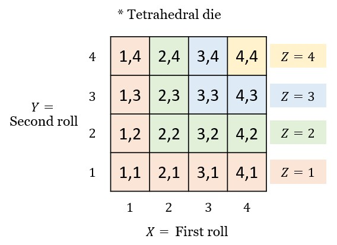
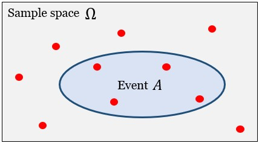
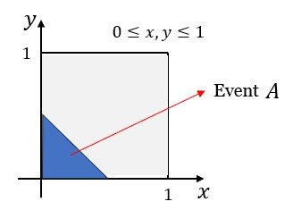

Putting together a <b>probablistic model</b> that is,<br>
a model of a random phenomenon or a random experiment,<br>
involves two steps.
1. Describe possible outcomes<br>
2. Describe beliefs about likelihood of outcomes<br>
<br>

## ¶ 1. Describe possible outcomes ¶

### ◎ Sample space $(\Omega)$
- $\Omega$ : Set of possible outcomes<br>

The elements of $\Omega$ should be
- <b>Mutually exclusive</b> :<br>
At the end of an experiment, there can only be one of the outcomes in $\Omega$.<br>
When one outcome has happened, then it should not be possible that any other outcomes also happened.
- <b>Collectively exhaustive</b> :<br>
All of the elements of the $\Omega$ <b>exhaust</b> all the possibilities.

💡Example : Flipping a coin.<br>
Which one is the right sample space?<br>
It depends on <b>what kind of questions you want to answer</b>.

1. $\Omega_{1} = \set{H, T}$
2. $\Omega_{2}$ = {$H$ & rains, $H$ & no rain, $T$ & rains, $T$ & no rain}

If you have a theory that the weather affects the behavior of coins,<br>then you might want to work with the $\Omega_{2}$.<br>
💡──────────
<br><br>

**○ Discrete sample space $\Omega$**<br>
💡Example : Two rolls of tetrahedral die
- Outcomes $(2,3)$ and $(3,2)$ are different.<br>
<p align="center">
    
</p>
💡──────────
<br><br>

**○ Continuous sample space $\Omega$**<br>
💡Example :
<p align="center">
    
</p>
💡──────────
<br><br><br>

## ¶ 2. Describe beliefs about likelihood of outcomes ¶
<b>Assign probabilities to the different outcomes or events.</b><br>
Specify which outcomes are <b>more likely</b> to occur<br>
and which ones are <b>less likely</b> to occur.
<br><br>

### ◎ Event
**○ Probability at a particular point**<br>
what is the probability at a <b>particular point</b> $(x,y)$<br>
in a <b>continuous</b> sample space?

<p align="center">
    
</p>

This probability would be essentially zero. $(P(x,y) = 0)$<br>
Any <b>individual point</b> sholud have <b>zero probability</b>. 

**○ Event : A subset of the sample space $\Omega$.**<br>
Once we carry out an experiment, we observe an outcome.
- Either this outcome is <b>inside the set $A$</b>,<br>
then we say that event <b>$A$ has occurred</b>.
- Or the outcome falls <b>outside the set $A$</b>,<br>
in which case we say that event <b>$A$ did not occurred</b>.
<br><br>

### ◎ Probability axioms
1) Non-negativity : $P(A) >= 0$
2) Normalization : $P(\Omega) = 1$ ($\Omega$ : entire sample space)
3) Additivity <a href="https://chatgpt.com/share/699403dc-7e9c-8003-a06d-4e623f8df7bf">(❓Chatgpt)</a>
    - 3-1. Finite Additivity :<br>
    $P(A \cup B) = P(A) + P(B)$ for <b>disjoint</b> sets $A$ and $B$. (i.e. $A \cap B = \emptyset$)
    - 3-2. Countable Additivity :<br>
    If $A_{1},A_{2},A_{3},\cdots$ is an infinite <b>sequence</b> of <b>disjoint</b> events,<br>
    then $P(A_{1} \cup A_{2} \cup A_{3} \cup \cdots) = P(A_{1}) + P(A_{2}) + P(A_{3}) + \cdots$<br>
    (Without the <b>sequence</b> structure, this axiom would <b>fail in continuous</b> sample spaces.)

**○ Some consequences of the axioms**<br>
- $P(A) \le 1 \quad,\quad P(\emptyset) = 0$
- $P(A) + P(A^{C}) = 1$
- $P(A \cup B \cup C) = P(A)+P(B)+P(C)$ (for disjoint sets)
- If $A \subset B$, then $P(A) \le P(B)$
- $P(A \cup B) = P(A) + P(B) - P(A \cap B)$
- Union bound : $P(A \cup B) \le P(A) + P(B)$
- $P(A \cup B \cup C) = P(A) + P(B \cap A^{C}) + P(C \cap A^{C} \cap B^{C})$
<br><br>

### ◎ Probability calculation

**○ Probability calculation steps**
1. Specify the <b>sample space</b>
2. Specify a <b>probability law</b>
3. Identify an <b>event of interest</b>
4. Calculate
<br><br>

**○ Discrete**

💡Example : Two rolls of tetrahedral die<br>
Let every possible outcome have same probability $\frac{1}{16}$.
- $P(X=1)=\cdots=P(X=4)=4*\frac{1}{16}=\frac{1}{4}$
- $P(Y=1)=\cdots=P(Y=4)=4*\frac{1}{16}=\frac{1}{4}$

Let $Z = \min{(X, Y)}$,
<p align="center">
    
</p>

- then $[P(Z=1),P(Z=2),P(Z=3),P(Z=4)] = [\frac{7}{16},\frac{5}{16},\frac{3}{16},\frac{1}{16}]$

💡──────────<br>

**○ Discrete uniform law**<br>
- Assume $\Omega$ consists of $n$ <b>equally likely</b> elements.
- Assume $A$ consists of $k$ elements.
<p align="center">
    
</p>

then, $P(A) = k * \frac{1}{n} = \frac{k}{n}$
<br><br>

**○ Discrete, but infinite**

💡Example : The number of tosses until we observe heads for the first time. <br>

1. Specify the <b>sample space</b> $\Omega : \set{1,2,\cdots}$<br>
Any positive integer is possible, so the $\Omega$ is <b>discrete but infinite</b>.

2. Specify a <b>probability law</b> : $P(n)=\frac{1}{2^{n}}$<br>
❗ Check : Are they legitimate probability law? ❗<br>
    - Do they add to $1$? (Normalization in axioms)<br>
    Yes. $\quad(\sum_{n=1}^{\infty}{\frac{1}{2^{n}}} = 1)$

3. Identify an <b>event of interest</b>.<br>
event $A$ : where $n$ is even.

4. Calculate
```math
\begin{align*}
P(n \:\text{is even}) {} &= P(\set{2,4,6,\cdots}) \\
&= P(\set{2} \cup \set{4} \cup \set{6} \cup \cdots) \\
&= P(2) + P(4) + P(6) + \cdots \quad\text{(Countable Additivity in axioms)} \\
&= \frac{1}{3}
\end{align*}
```
💡──────────
<br><br>

**○ Continuous**<br>
💡Example : $x+y \le \frac{1}{2}$<br>
<p align="center">
    
</p>

- $P(A) = P(\set{(x,y) | x+y \le \frac{1}{2}}) = \frac{1}{8}$
- $P(\set{(0.5,0.3)}) = 0$ (Zero prob. at a point)

💡──────────
