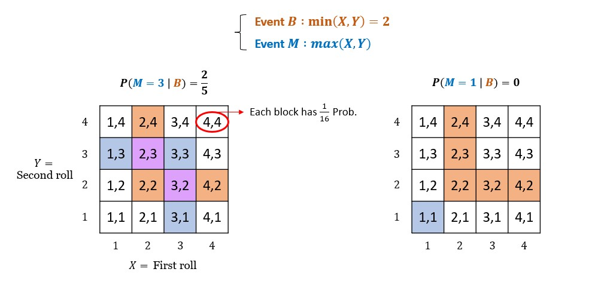
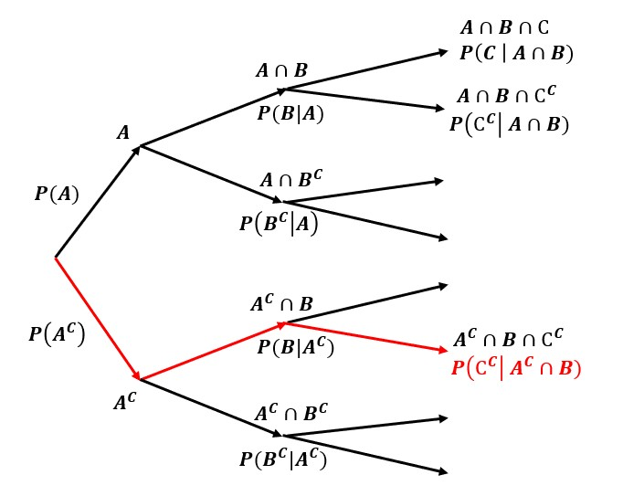
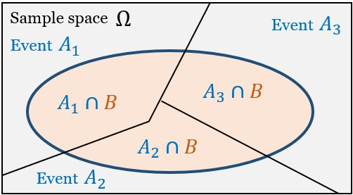

## ¶ Conditional Probability ¶

$P(A \mid B)$ : "Probability of $A$, given that $B$ has occured."

```math
P(A \mid B) = \frac{P(A\cap B)}{P(B)} \quad(\text{defined only when } P(B) > 0)
```


💡Example : Two rolls of 4-sided die
<p align="center">
    
</p>

```math
P(M=3 \mid B) = \frac{2}{5} \:,\quad P(M=1 \mid B) = 0
```
💡──────────

**○ Conditional probabilities share properties of ordinary probabilities.**<br>
- $P(A \mid B) \ge 0$ assuming $P(B) > 0$
- $P(\Omega \mid B) = 1$ , $P(B \mid B) = 1$
- If $A \cap C = \emptyset$ then $P(A \cup C \mid B) = P(A \mid B) + P(C \mid B)$

**○ The multipliaction rule**<br>
```math
P(A \mid B) = \frac{P(A \cap B)}{P(B)} \\
P(A \cap B) = P(A)P(B \mid A) = P(B)P(A \mid B)
```
<br>

💡Example
<p align="center">
    
</p>

```math
\begin{align*}
{} & P(A^{C} \cap B \cap C^{C}) \\
&= P(A^{C} \cap B) \: P(C^{C} \mid A^{C} \cap B) \\
&= P(A^{C}) \: P(B \mid A^{C}) \: P(C^{C} \mid A^{C} \cap B)
\end{align*}
```
💡──────────

The most general version of the multiplication rule.
```math
\begin{align*}
{} & P(A_{1} \cap A_{2} \cap \cdots \cap A_{n-1} \cap A_{n}) \\
&= P(A_{1} \cap A_{2} \cap \cdots \cap A_{n-1}) \: P(A_{n} \mid A_{1} \cap \cdots \cap A_{n-1}) \\
&= P(A_{1} \cap A_{2} \cap \cdots \cap A_{n-2}) \: P(A_{n-1} \mid A_{1} \cap \cdots \cap A_{n-2}) \: P(A_{n} \mid A_{1} \cap \cdots \cap A_{n-1}) \\
&= P(A_{1}) \:\prod_{i=2}^{n} P(A_{i} \mid A_{1} \cap \cdots \cap A_{i-1})
\end{align*}
```

## ¶ Bayes' Rule ¶

### ◎ Total probability theorem
<p align="center">
    
</p>

```math
\begin{align*}
P(B) {} &= P(B\cap A_{1}) + P(B\cap A_{2}) + P(B\cap A_{3}) \\
&= P(A_{1})P(B \mid A_{1}) + P(A_{2})P(B \mid A_{2}) + P(A_{3})P(B \mid A_{3})
\end{align*}
```
```math
\therefore P(B) = \sum_{i} \underbrace{P(A_{i})}_{weights} P(B \mid A_{i}) \quad(\text{→ weighted average of }P(B \mid A_{i}))
```

### ◎ Bayes' rule
```math
\begin{align*}
P(A_{i} \mid B) {} &= \frac{P(A_{i}) \: P(B \mid A_{i})}{P(B)} \\
&= \frac{P(A_{i}) \: P(B \mid A_{i})}{\sum_{i} P(A_{i}) \: P(B \mid A_{i})} \\\\
\text{→ Posterior} &= \frac{\text{Prior} \times \text{Likelihood}}{\text{Evidence}}
\end{align*}
```

- Prior : Belief before evidence
- Posterior : Belief after evidence
- Likelihood : How compatible the evidence is

💡Example : Coin bias<br>
You believe a coin is "fair" at first.<br>
Then you observe 10 heads in a row.<br>
Now your <b>revised belief</b> shifts heavily toward “biased.”<br>
Bayes formalizes exactly how much.<br>

We are unsure whether a coin is :<br>
- $H_{0}$ : Fair (50-50%) → $P(H) = 0.5$
- $H_{1}$ : Biased (70-30%) → $P(H) = 0.7$

These are two competing hypotheses.

🔵 Step 1 : <b>Prior</b> (Initial beliefs)<br>
Before seeing data, suppose we believe :
- $P(H_{0}) = 0.5$
- $P(H_{1}) = 0.5$

So we think it's equally likely to be fair or biased.

🎯 Step 2: <b>Evidence</b><br>
We flip the coin 10 times and observe :<br>
- Data $=$ Event $E$ $=$ $10$ heads in a row

Call this event $E$.

🔥 Step 3: <b>Likelihoods</b><br>
Now compute how likely this evidence is under each hypothesis.
- Under $H_{0}$ (Fair)
```math
P(E\mid H_{0}) = (0.5)^{10} = \frac{1}{1024} \approx 0.00098
```
- Under $H_{1}$ (Biased)
```math
P(E\mid H_{0}) = (0.7)^{10} \approx 0.0282475
```

Under the biased coin,<br>
10 heads is about <b>29 times more likely</b> than fair one.
```math
\frac{0.0282475}{0.00098} \approx 28.8
```
This ratio is called the <b>likelihood ratio</b>.

🔵 Step 4: Compute <b>Evidence</b> Probability<br>
Now compute total probability of observing 10 heads:
```math
\begin{align*}
P(E) {} &= P(E\mid H_{0})P(H_{0}) + P(E\mid H_{1})P(H_{1}) \\
&= 0.00098(0.5) + 0.02825(0.5) \\
&= 0.00049 + 0.014125 = 0.014615
\end{align*}
```

🎯 Step 5: <b>Posterior</b><br>
Apply Bayes :
```math
\begin{align*}
P(H_{1}\mid E) {} &= \frac{P(E\mid H_{1})\:P(H_{1})}{P(E)} \\
&= \frac{0.02825(0.5)}{0.014615} \approx 0.967
\end{align*}
```
💡──────────