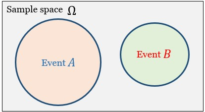
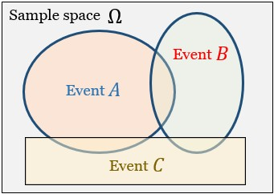
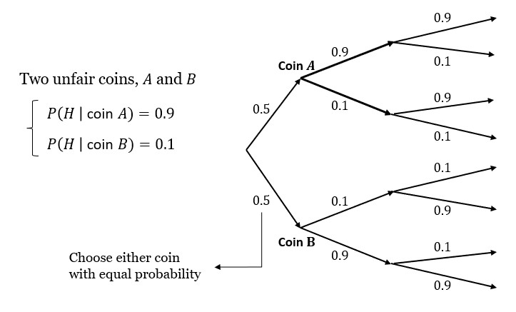
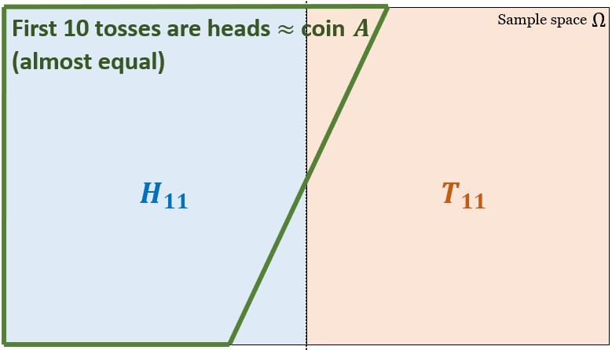

## ¶ Independence ¶

**○ Definition**<br>

<b>Intuitive definition</b> :<br>
Occurence of $A$ provides no new information about $B$.<br>
(Knowing what happend before doesn't change your belief about later things.)
```math
P(B\mid A) = P(B)
```

<b>Definition of independence</b> :
```math
\begin{align*}
P(A\cap B) = P(A)\:P(B\mid A) = P(A)P(B)
\end{align*}
```

**○ Properties**<br>

- Symmetric w.r.t. $A$ and $B$ implies :
```math
P(A\mid B) = P(A)
```
- Applies even if $P(A) = 0$.
- Being <b>independent</b> is completely different from being <b>disjoint</b>.
<p align="center">
    
</p>

Given <b>disjoint</b> events $A$ and $B$ where $P(A) > 0$ and $P(B) > 0$,<br>
$A$ and $B$ are <b>not independent</b>.

```math
\begin{align*}
[P(A\cap B) = 0] \not= [P(A)P(B) > 0]
\end{align*}
```
Knowing that $A$ has happend, we can notice that $B$ will never happen.<br>
(because $A$ and $B$ are <b>disjoint</b>).<br>
i.e. $A$ and $B$ affect each other.<br>
($A$ and $B$ are <b>not independent</b>.)

- Independence of event complements<br>
If $A$ and $B$ are independent, then $A$ and $B^{C}$ are independent.
```math
\text{From}\quad A = (A\cap B)\cup(A\cap B^{C}) \quad,\\
P(A) = P(A\cap B)+P(A\cap B^{C}) \quad\text{by Additivity axiom.}
```
```math
\begin{align*}
P(A) {} &= P(A\cap B) + P(A\cap B^{C}) \\
&= P(A)P(B) + P(A\cap B^{C})
\end{align*}
```
```math
\begin{align*}
P(A\cap B^{C}) {} &= P(A) - P(A)P(B) \\
&= P(A)(1 - P(B)) \\
&= P(A)P(B^{C})
\end{align*}
```
```math
\therefore\: A\: \text{and}\: B^{C} \text{are independent by definition.}
```
<br>

### ◎ Conditional independence

**○ Definition**<br>
Conditional independence, given $C$,<br>
is defined as independence under the probability law $P(.\mid C)$
```math
P(A\cap B\mid C) = P(A\mid C)P(B\mid C)
```
<br>

**○ Conditioning may affect independence**<br>

<$A$ and $B$ are independent> doesn't mean <$A\mid C$ and $B\mid C$ are independent>.<br>

💡Example :
<p align="center">
    
</p>

Assume $A$ and $B$ are independent.<br>
Given $C$ occured, $A$ and $B$ are <b>disjoint and not independent</b>.<br>
→ $P(A\mid C) > 0 \:,\: P(B\mid C) > 0 \:,\: P(A\cap B\mid C) = 0$

💡──────────
<br>

💡Example : Toss two unfair coins.
<p align="center">
    
</p>

🎯 Are coin tosses independent? : <b>No</b><br>

Compare
- $11$-th coin toss
```math
\begin{align*}
P(H_{11}) {} &= P(A)P(H_{11}\mid A) + P(B)P(H_{11}\mid B) \\
&= (0.5 * 0.9) + (0.5 * 0.1) \\
&= 0.5
\end{align*}
```

- $11$-th coin toss, (condition) given the first $10$ tosses are all heads.<br>
($H_{1-10}$ : First $10$ tosses are heads)
<p align="center">
    
</p>

```math
\begin{align*}
P(H_{11}\mid H_{1-10}) {} &= \frac{P(H_{11}\cap H_{1-10})}{P(H_{1-10})} \\
&= \frac{0.5(0.9^{11}+\cancel{0.1^{11}})}{0.5(0.9^{10}+\cancel{0.1^{10}})} \\
&\approx 0.9 = P(H_{11}\mid A) \not= P(H_{11})
\end{align*}
```
```math
\begin{align*}
\therefore\:{}&\text{Coin tosses are dependent.} \\
&\text{If they were independent,}
\end{align*}
```
```math
\begin{align*}
P(H_{11}\mid H_{1-10}) {} &= \frac{P(H_{11}\cap H_{1-10})}{P(H_{1-10})} \\
&= \frac{P(H_{11})P(H_{1-10})}{P(H_{1-10})} \\
&= P(H_{11}) = 0.5
\end{align*}
```

### ◎ Independence of a collection of events
**○ Definition**<br>

<b>Intuitive definition</b> :<br>
Information on some of the events does not change probabilities (or beliefs)<br>
related to the remaining events.

💡Example :
```math
P(A_{3}) = P(A_{3}\mid A_{1}\cap A_{2}) = P(A_{3}\mid A_{1}\cap A_{2}^{C}) = P(A_{3}\mid A_{1}^{C}\cap A_{2})
```
💡──────────

<b>Definition</b> :<br>
Events $A_{1}, A_{2}, \cdots, A_{n}$ are called <b>independent</b> if
```math
P(A_{i}\cap A_{j}\cap\cdots\cap A_{m}) = P(A_{i})P(A_{j})\cdots P(A_{m})
```
for any distinct indices $1 \le i, j, \cdots, m \le n$.

